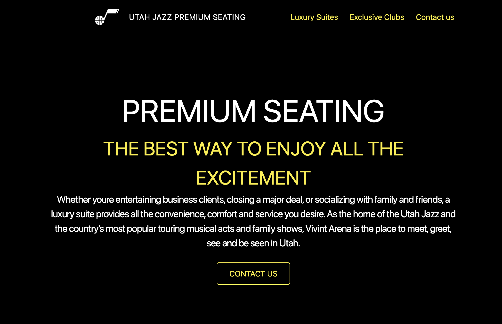
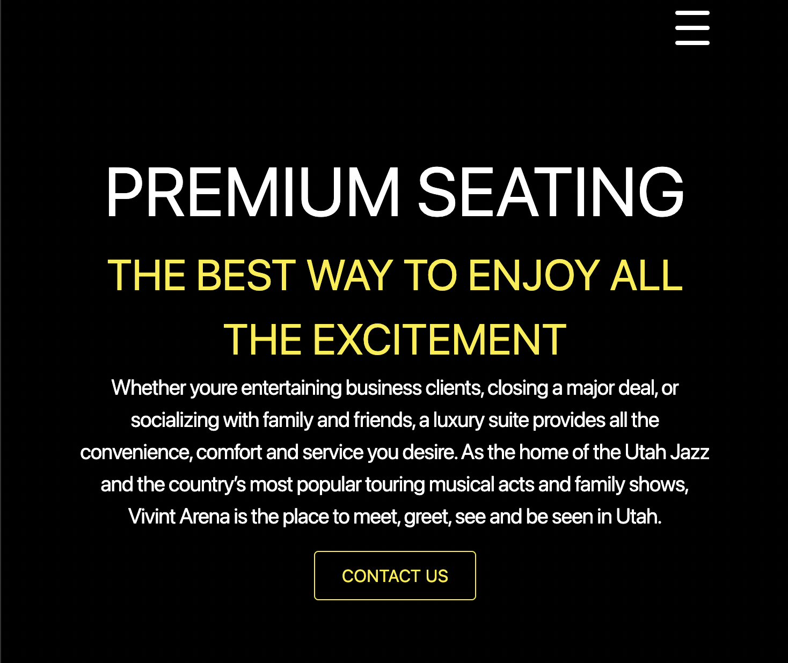

# Jazzy Suites! :wave:

  ### By bridgetvon * [Email me](bridget.schaefer31@gmail.com) * 

  ## Table of contents 📚
  * [Description](#Description)
  * [User Story](#User-story) 
  * [Installation Instructions](#installation-Instructions)
  * [Contributing](#Contributing)

  # Visual
 
 
 
 
  # Description
    A mock website of the homepage of the premium suites for the Utah Jazz and a page of the Eide Bailly Suite page for the Utah Jazz. Built with Next.js and tailwinds.css

  ## User Story :book:
  ```
  AS a developer
  I WANT to mock a website 
  SO THAT I can learn new technologies and broaden my skill-set

  ```

  ## Installation Instructions :hammer_and_wrench:
  No installation, simply navigate to the deployed application

  ## Deployed 
   https://jazzy-suites-7a5218dtm-bridgetvon.vercel.app/

  ## License :credit_card:
  * License Type: N/A


 ## Contributing 
 Bridget Schaefer 
    
 [Click to view my GitHub Profile!](https://github.com/bridgetvon) :skier: